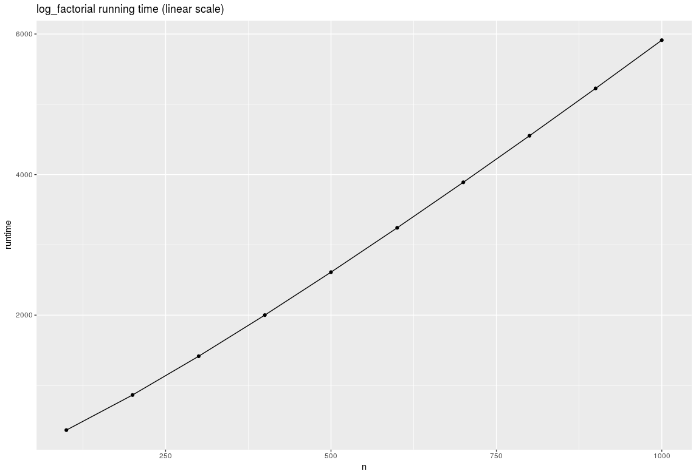
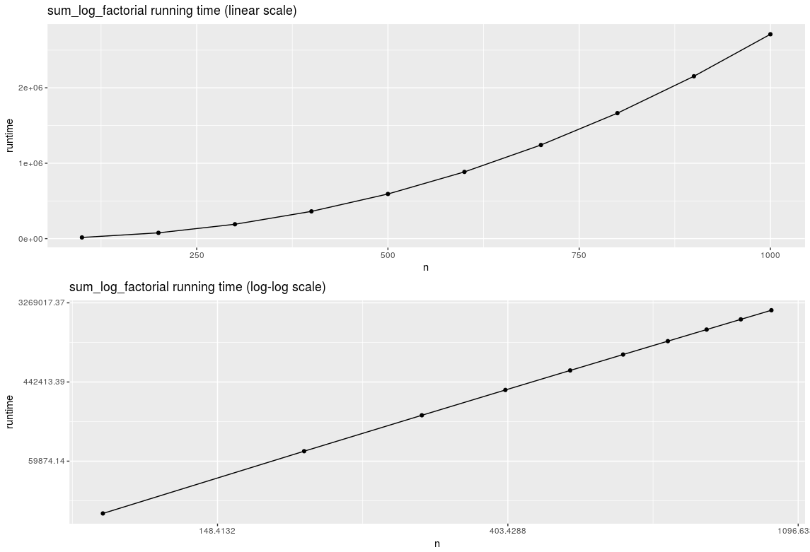
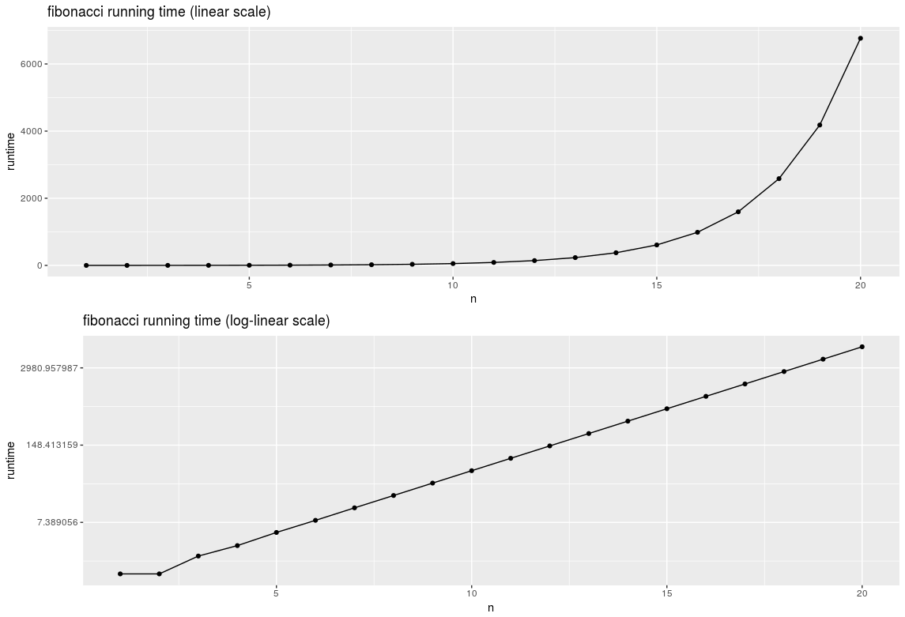

AC3: Time Complexity - CSE 6242

mmendiola3


## Run time plots

{#id .class width=50%}
{#id .class width=50%}

{#id .class width=50%}


## Time Complexities

- log_factorial: O(n)
- sum_log_factorial: O(n^2)
- fibonacci: O(2^n)

## Code

```R
experiment <- function(func, iterations, step) {
  n_vector <- seq(step, iterations, by=step)
  time_vector <- sapply(n_vector, avg_time_execution, func=func)
  return(data.frame(n=n_vector, runtime=time_vector))
}

time_execution <- function(func, arg) {
  return(system.time(func(arg))[1])
}

avg_time_execution <- function(func, arg, n=5) {
  return(mean(replicate(n, func(arg))))
}

df_l <- experiment(log_factorial, 1000, 100)
df_s <- experiment(sum_log_factorial, 1000, 100)
df_f <- experiment(fibonacci, 20, 1)

ggplot(df_l, aes(x=n, y=runtime)) +
  geom_point() +
  geom_line() +
  ggtitle("log_factorial running time (linear scale)")

p1 <- ggplot(df_s, aes(x=n, y=runtime)) +
  geom_point() +
  geom_line() +
  ggtitle("sum_log_factorial running time (linear scale)")

p2 <- ggplot(df_s, aes(x=n, y=runtime)) +
  geom_point() +
  geom_line() +
  scale_x_continuous(trans="log") +
  scale_y_continuous(trans="log") +
  ggtitle("sum_log_factorial running time (log-log scale)")

multiplot(p1, p2)

p1 <- ggplot(df_f[], aes(x=n, y=runtime)) +
  geom_point() +
  geom_line() +
  ggtitle("fibonacci running time (linear scale)")

p2 <- ggplot(df_f[], aes(x=n, y=runtime)) +
  geom_point() +
  geom_line() +
  scale_y_continuous(trans="log") +
  ggtitle("fibonacci running time (log-linear scale)")

multiplot(p1, p2)
```
