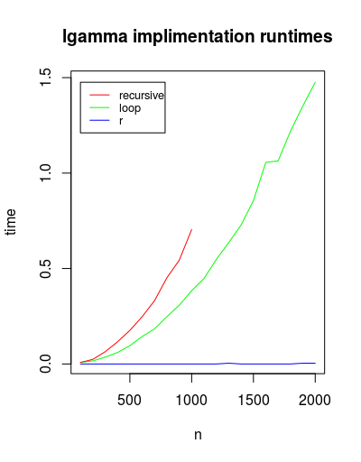

% HW1 - CSE 6242
% mmendiola3

# 1. Get Familiar with R

Having worked with pandas in the past, I'm familiar with Dataframes and the many indexing options. The subset function stands out to me as a more understandable way to lookup data. This also translates well when building applications that require RDBMS queries.

```R
> data("iris")
> subset(iris, Sepal.Length < 5 & Species != 'setosa')
>     Sepal.Length Sepal.Width Petal.Length Petal.Width    Species
>     58           4.9         2.4          3.3         1.0 versicolor
>     107          4.9         2.5          4.5         1.7  virginica
```

2. Log Gamma (Loop)

*See hw1.r*

3. Log Gamma (Recursive)

*See hw1.r*

4. Sum of Log Gamma

*See hw1.r*


5. Compare Results to Built-In R Function



Figure \ref{runtimes} shows the runtime growth of each sum of lgamma function for increasing values of n. We see that the native R lgamma function remains either consistant or linear.

The recursive and loop implimentations show what looks like exponential growth, with the recursive function growing faster than the loop version. The recursive function also errors out with higher values of n.


