% HW2: Data Visualization - CSE 6242
% mmendiola3


# 1. Professional Employment by State

**This answer uses interpretation B**

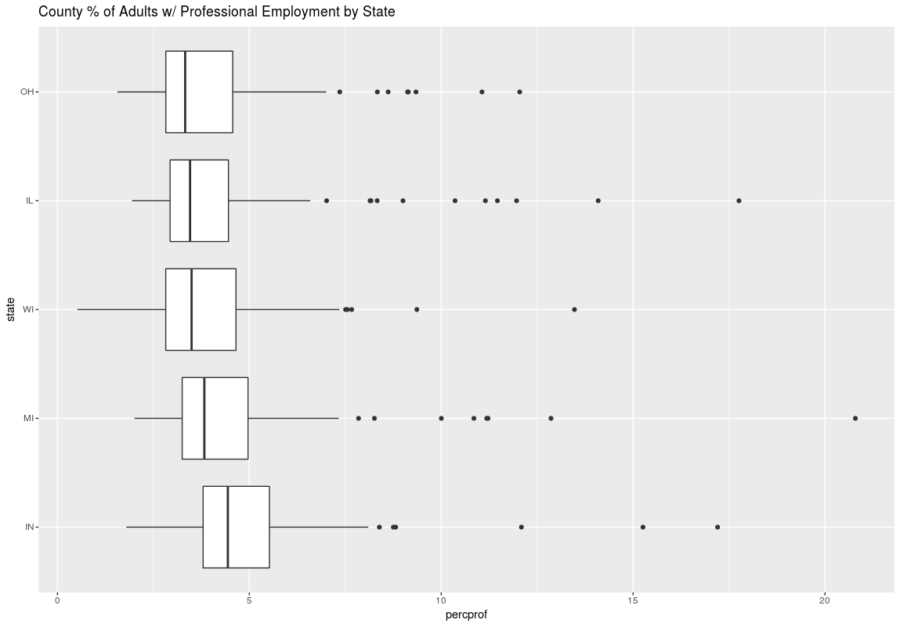

Figure \ref{percprof} shows the distribution of midwest\$percprof values across each state. This is the percentage of each county's adult population with professional employment. 


Observations:

- The median value is fairly close between states; between 3% and 4% for each state.
- OH has the lowest median at ~3%.
- IN has the highest median at ~4%.
- WI has counties with lower values than any other state.
- MI has the county with the highest value, but IN has the highest value not considered an outlier.
- Variance across states is similar, with IL having the lowest variance.
- Every state's distribution is skewed upwards, indicating they each have counties with values significantly higher than the median. Each state also has a number of outlier counties with values greater the distribution range (IQR + 1.5 IQR length).


# 2. High School and College Education by State

**This answer uses interpretation B**

## perchsd / percollege relationship

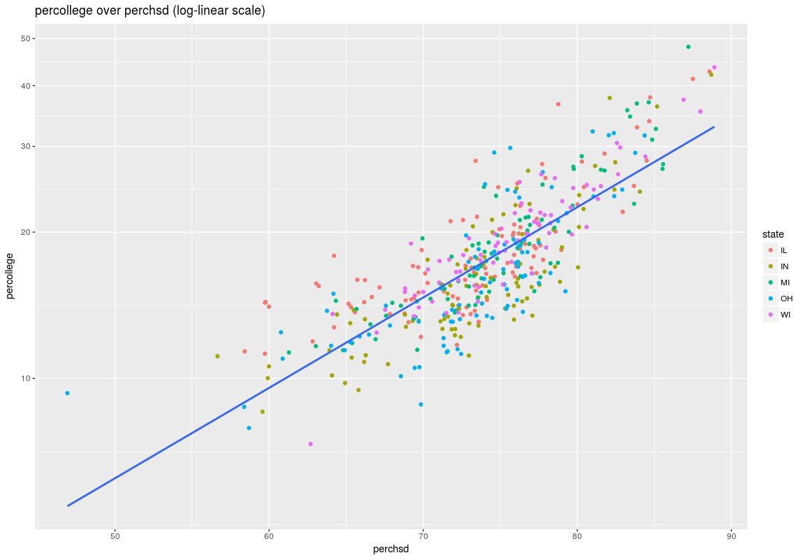{#id .class width=75%}

Figure \ref{hsd_college_log} shows a scatter plot of perchsd over percollege. This shows the relationship between the percentage of each county's adult population with a high school diploma and the percentage of each county's adult population with a college diploma. The perchsd/percollege scatter plot is in log-linear scale.

Observations:

- The perchsd / percollege scatter plot visually appears to have a positive relationship.
- The correlation coefficient of perchsd and log(percollege) indicates an exponential relationship between the two (0.81). It's possible there is linear or power relationship between the two, but the correlation coefficient is lower for both perchsd, percollege (0.78) and log(perchsd), log(percollege) (0.79).


## perchsd / state relationship

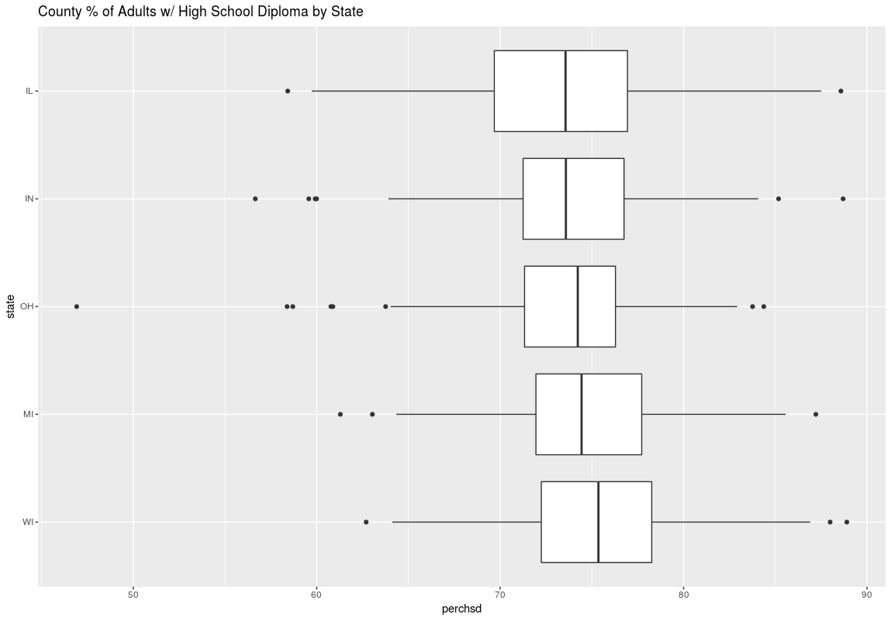{#id .class width=75%}

Figure \ref{perchsd_state} shows the distribution of midwest\$perchsd values across each state. This is the percentage of each county's adult population with a high school diploma. 

Observations:

- The median value is fairly close between states; between 73% and 76% for each state.
- IL has the lowest median at ~73%.
- WI has the highest median at ~76%.
- WI has the county with the highest value (~89%), but IL has the highest value not considered an outlier (~87).
- OH has the county with the lowest value (~46%), but IL has the lowest value not considered an outlier (~60%).
- Variance across states is similar, with OH having the lowest variance and IL having the highest.
- IL, OH, and WI distributions are skewed downward, indicating they each have counties with values significantly lower than the median. 
- IN and MI distributions are skewed upward, indicating they each have counties with values significantly higher than the median. 
- Each state has outlier counties with values both lower and higher than the distribution range (IQR +/- 1.5 IQR length).


## percollege / state relationship

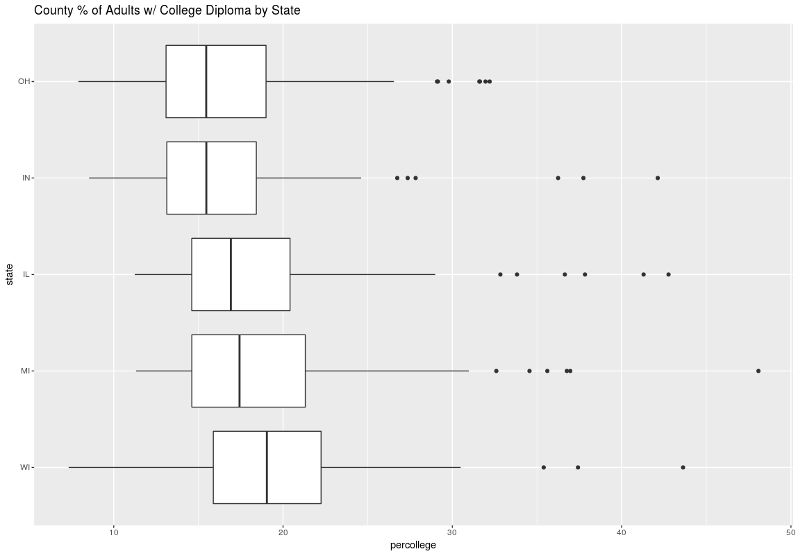{#id .class width=75%}

Figure \ref{percollege_state} shows the distribution of midwest\$percollege values across each state. This is the percentage of each county's adult population with a college diploma. 

Observations:

- The median value is fairly close between states; between 15% and 19% for each state.
- OH has the lowest median at ~15%.
- WI has the highest median at ~19%.
- MI has the county with the highest value (~48%) and the highest value not considered an outlier (~31).
- WI has the county with the lowest value (~8%).
- Variance across states is similar, with IN having the lowest variance and MI having the highest.
- All states' distributions are skewed upward, with the possible exception of WI.
- Each state has outlier counties with values higher than the distribution range (IQR +/- 1.5 IQR length).


# 3. Comparison of Visualization Techniques

## Box Plot elements and relationship to size of a dataset

Box plots have the following elements:

- The IQR box shows the interval between the first and third quartiles. This shows where 50% of the data lays.
- The median line shows the point where half the data points are above and the other half are below.
- The whiskers show the range of values within the dataset. These lines are limited to 1.5x the length of the IQR.
- Outliers are points that fall outside the range of the whiskers.

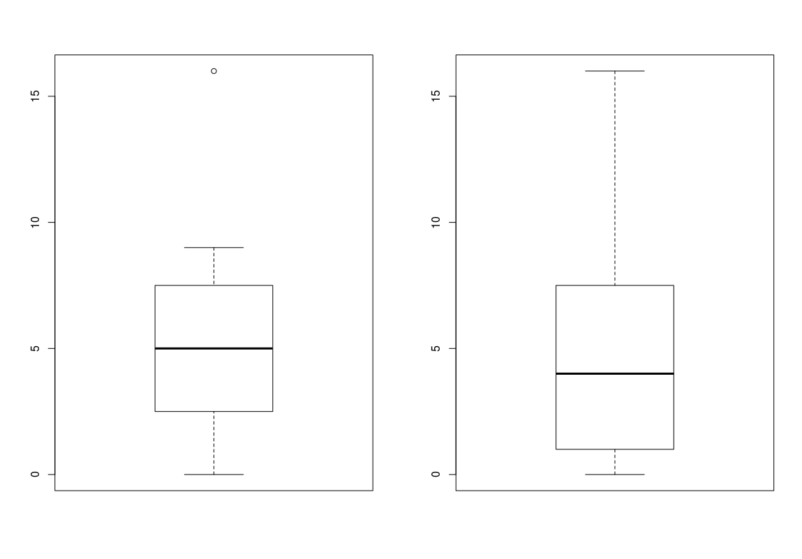{#id .class width=75%}

Figure \ref{box_example} shows how statistical properties of a dataset affects each box plot element. The values for these two plots are:

```R
  # left-hand plot
  c(0,1,2,3,4,5,6,7,8,9,20)
  # right-hand plot
  c(0,1,1,1,4,4,6,7,8,9,21)
```

Observations:

- The left-hand plot has a median line at 5, while the right-hand is at 4. These are the respective median values from the datasets.
- The IQR for each differs in size as the left-hand plot has less variance in it's dataset.
- The right-hand plot is skewed upward, as it has a number of lower values (0,1,1,1,1) who's mean in pulled up by a small number of high values. 
- The left-hand plot is more symmetric. Values not considered outliers are evenly distributed.
- The left-hand plot whiskers are differing lengths due to the outlier value pulling the IQR up.
- The high value on the right-hand plot falls within the distribution range (1.5x the IQR from the IQR), so it is not considered an outlier. This extends the whisker all the way to the upper value.


# Pros and cons of a Box Plot and a Histogram

Histograms are good for visualizing the distribution of values in a dataset. This is especially helpful if the distribution is multi-modal. However, they do not make it easy to get summary information about the distribution. 

Box plots allow one to see distribution parameters (median, range, percentiles, and outliers). This is helpful when comparing the distribution properties between multiple datasets. 

Box plots are better at showing the distributions skew and symmetry, but are not as good at showing the shape of the distribution (to estimate the underlying theoretical distribution).


# Data for which to use Histograms, Box Plots, and QQPlots

Histograms are useful for visualizing the data's distribution. This is helpful when trying to gauge the type of underlying distribution the values could match. For example, we could see clearly whether data resembles a bimodal, uniform, or normal distribution. A box plot loses this information. A qq-plot requires that you define the distribution to compare your data against. Therefore, it is not a good choice when initially trying to identify a matching distribution.

Box plots are useful when comparing data distribution statistics between multiple datasets or factors. The data from questions one and two are good examples. They allow the observation of differences between the range of values between the various states.

QQ-plots are appropriate for comparing how a distribution of values compares to another distribution. This includes theoretical distributions. For example, they would help to determine if the values in a dataset are normally distributed, or if two datasets share a common distribution.


# 4. Random Scatterplots

## Samples

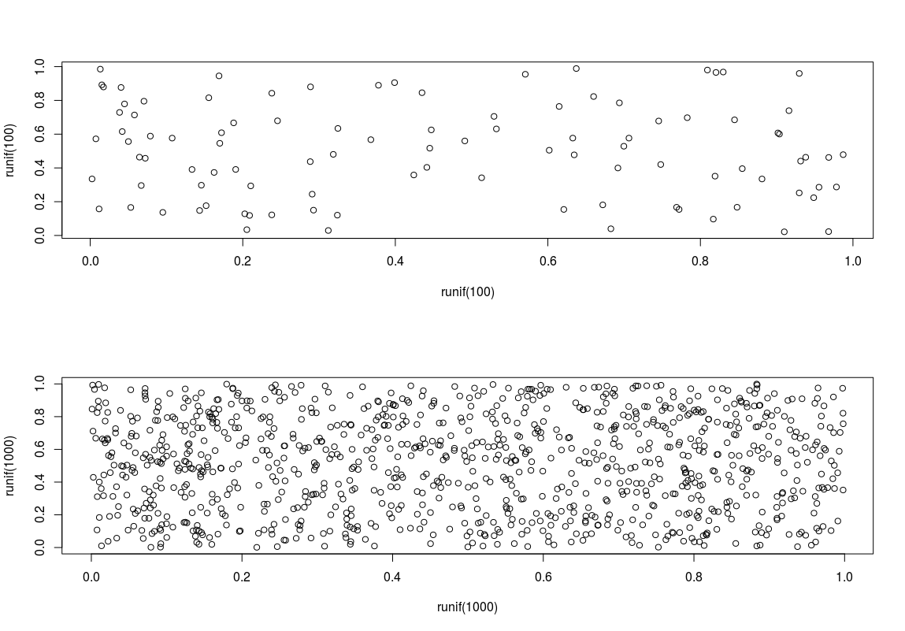

Figure \ref{rand_scatter} shows two plots of random x and y values. The top plot has 100 random points. The lower plot has 1,000 random points.


## Filesize over sample size

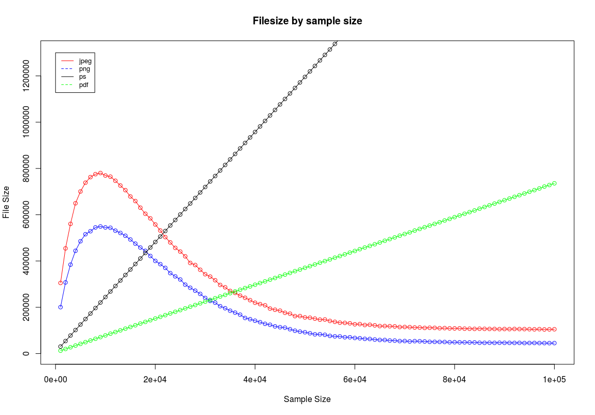{#id .class width=75%}

Figure \ref{filesize} shows the growth of the file size for each format as the size of the sample being plotted increases. 

Observations:

- jpeg and png files initially grow with the increase in sample size. This can be attributed to the raster formats' increase in pixels to encode as more samples are drawn. Eventually, the pixel density hits a point that more samples decrease the overall image complexity (more black pixels). From this point, additional samples decrease the file size until a minimum size is reached to save a completely saturated plot image. 
- ps and pdf formats start out with lower file sizes than the others, but grow linearly with the number of samples plotted. This is attributed to the increase in the number of objects that the vector image formats must encode. The growth for both of these formats is linear O(n).
- This graph indicates that for plots under a certain number of points (about 30k for in this case) vector formats are more space efficient. Beyond that, vector images are not only less efficient, but also have unbounded growth.


# 5. Diamonds

## Color Histogram

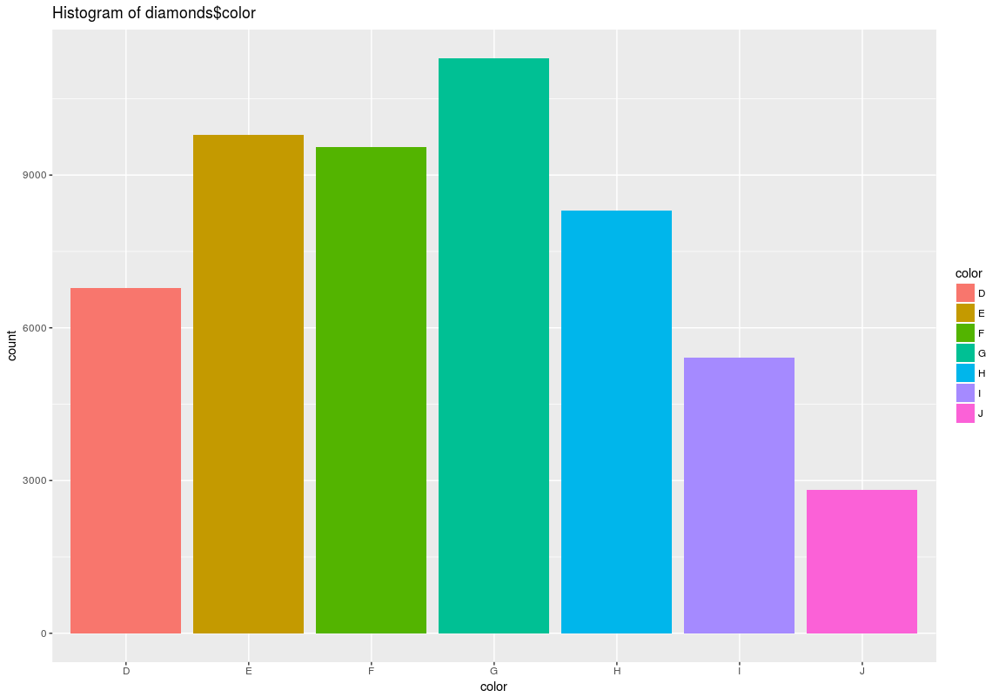{#id .class width=50%}

Figure \ref{color_hist} shows a histogram for diamond\$color.

Observations:

- It resembles a normal distribution, with the central color G as the mean value. Color is ordinal so this isn't just an effect of random ordering.
- J color diamonds are comparatively rare, and G color diamonds are comparatively common.


## Carat Histogram

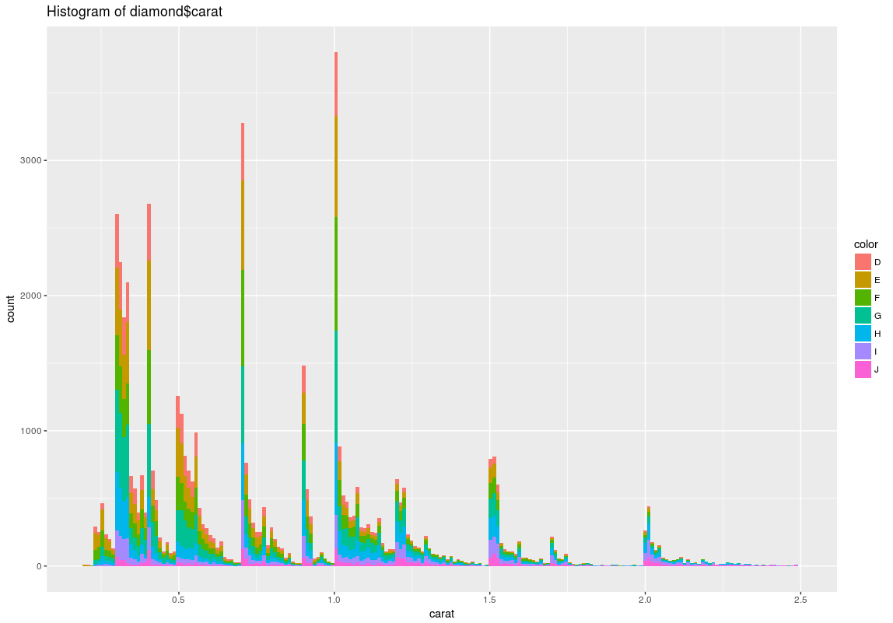

Figure \ref{carat_hist} shows a stack histogram for diamond\$carat with the intra-bin distribution colored by diamond\$color.

Observations:

- A pattern appears to show a number of popular carat values, with a downward tend as the carat value increases from one of these. This could have something to do with diamonds often being cut to standard sizes. It's difficult to speculate on the cause of the downward trend from these standard sizes.
- There is an overall trend of lower availability for diamonds with higher carats.
- Diamonds below ~0.3 carats are also more rare.
- Figure \ref{diamond_ggpairs} (carat continuous histogram) shows the most common size is just under 0.5 carats overall, and for each color besides J. J color diamonds are most commonly just over 1 carat.
- Proportions between colors seem to remain somewhat consistence for the various carat sizes besides color J. This can also be seen in the discrete carat histogram with color facets in Figure \ref{diamond_ggpairs}.


## Price Histogram

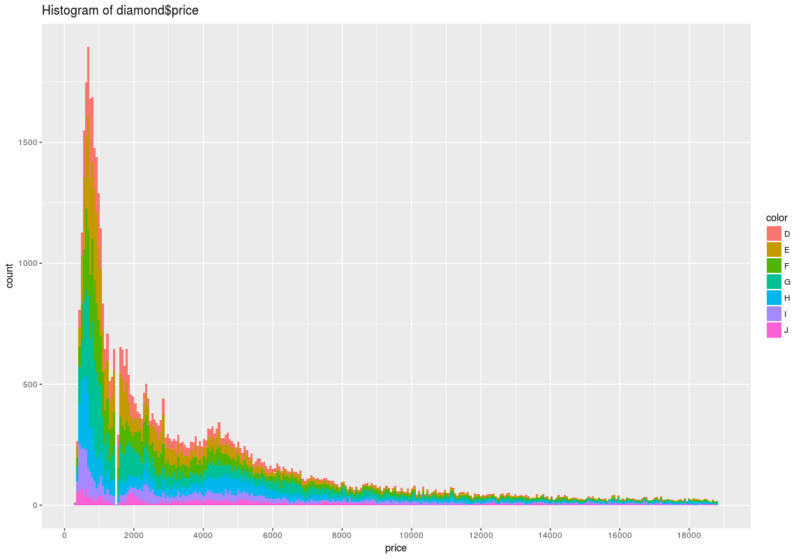

Figure \ref{price_hist} shows a stack histogram for diamond\$price with the intra-bin distribution colored by diamond\$color.

Observations:

- The distribution shows the most common diamond price is around $750.
- There is a non-linear decrease in availability as the price increases. The effect makes the availability of $12,000 diamonds not much different than $18,000 diamonds.
- There is a slight uptick in availability for diamonds in the $4,000 to $5,000 range.
- There is a small price range with a noticeable gap in available (~$1,500).
- Proportions between colors are somewhat consistence for the various prices. This can also be seen in the prices histogram with color facets in Figure \ref{diamond_ggpairs}.


## Relationships between color, carat, and price

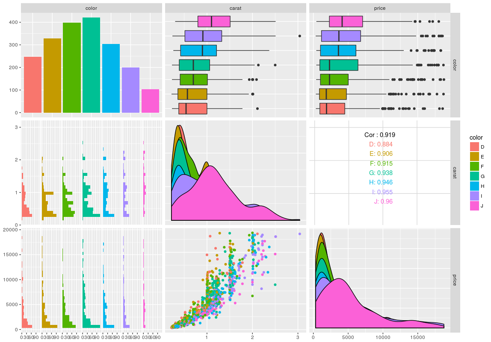


Figure \ref{diamond_ggpairs} shows the ggpairs plot of a sample (1,000 rows) from the diamond dataset. The result is a matrix of plots that help with the three way comparison of price, carat, and color.

Observations:

- There is a strong positive linear correlation between price and carat for each color separately, and combined.
- The price over carat plot shows a greater than linear curve.
- The price over carat plot shows an increase in price variance for larger carat sizes.
- There are clusters of carat sizes, especially after values greater than 1.5.
- Distribution of values for both carat and price are similar across each color. Rankings for median values is the same between price and carat (D low to J high).


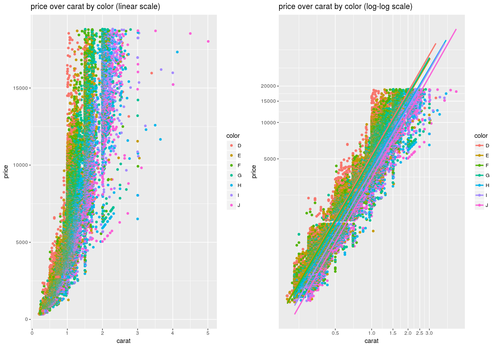


Figure \ref{price_carat_color} shows a scatter plot of price over carat with dots colored by diamond\$color. The left plot is on linear scale. The right plot is on log-log scale.

Observations:

- Both plots show striations of color, indicating a common relationship between price and carat within each color; and a separation in the values of each (price, carat) between each color.
- The log-log scale plot shows a positive linear relationship between log(price) and log(carat) (Adjusted R-Squared: 0.93). This indicates a positive power relationship between the two.
- Figure \ref{price_carat_ratio} shows that, although the median and IQR of the price-carat ratio is fairly close between colors, the availability of higher price to carat diamonds seems to correlate with color. As you move from J to D color diamonds, the highest price to carat diamonds available in that color increases.

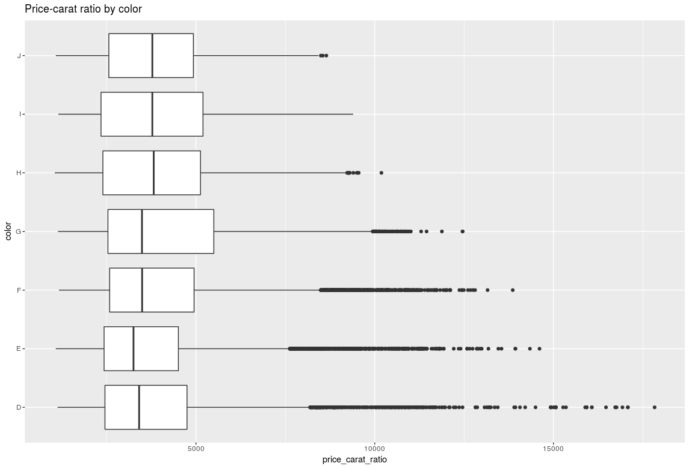
