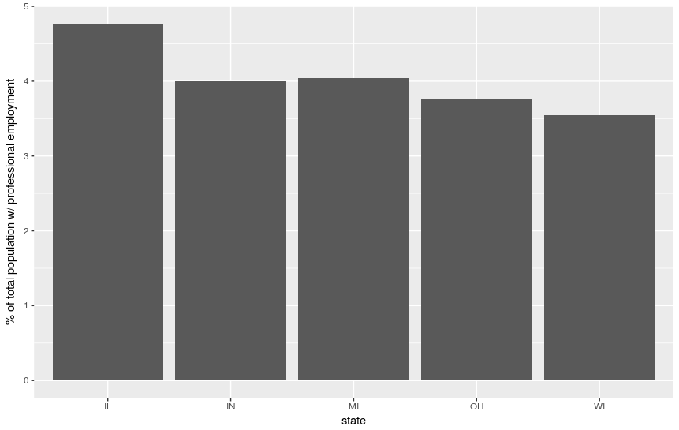

% HW2: Data Visualization - CSE 6242
% mmendiola3

# 1. Professional Employment by State

Figure \ref{percprof} shows the percentage of each state's adult population with professional employment. This shows that IL has the highest percentage at 7.5%, while WI has the lowest at 5.6%.

# 2. School and College Education by State

# 3. Comparison of Visualization Techniques

# 4. Random Scatterplots

# 5. Diamonds
