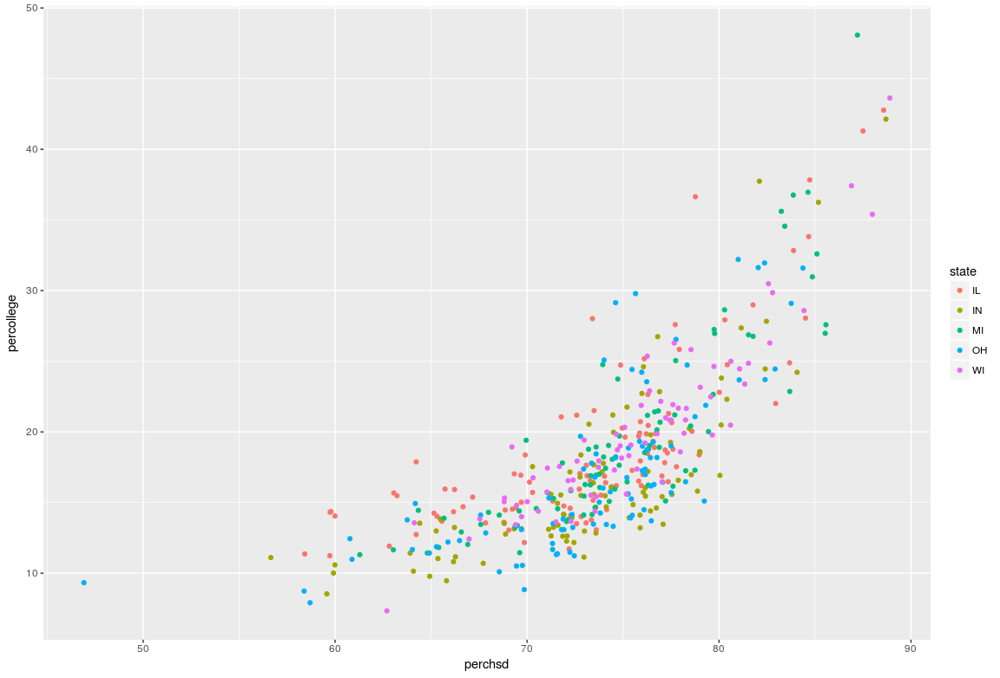
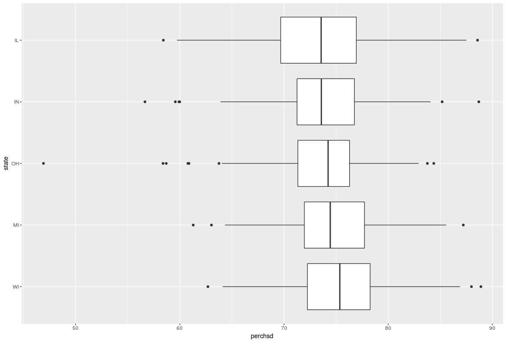
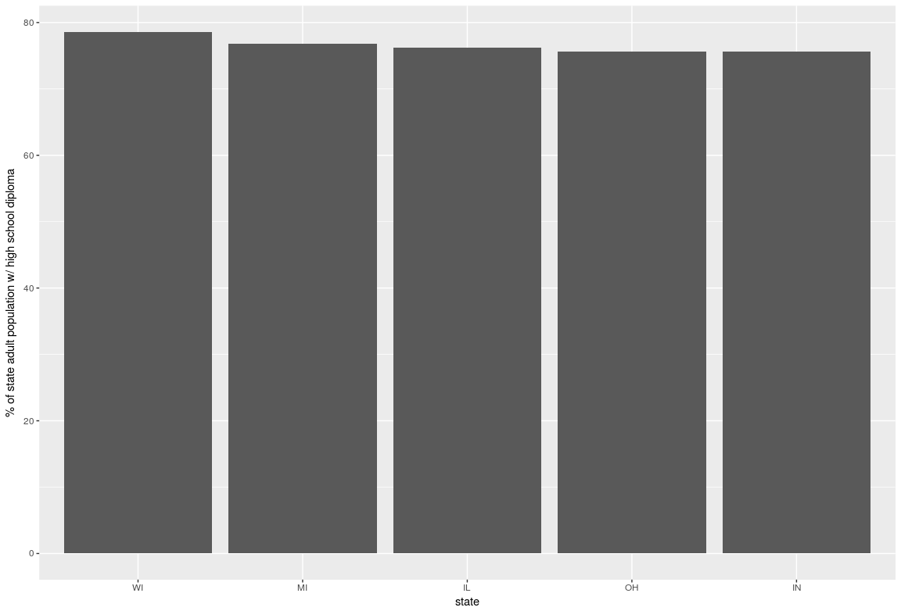
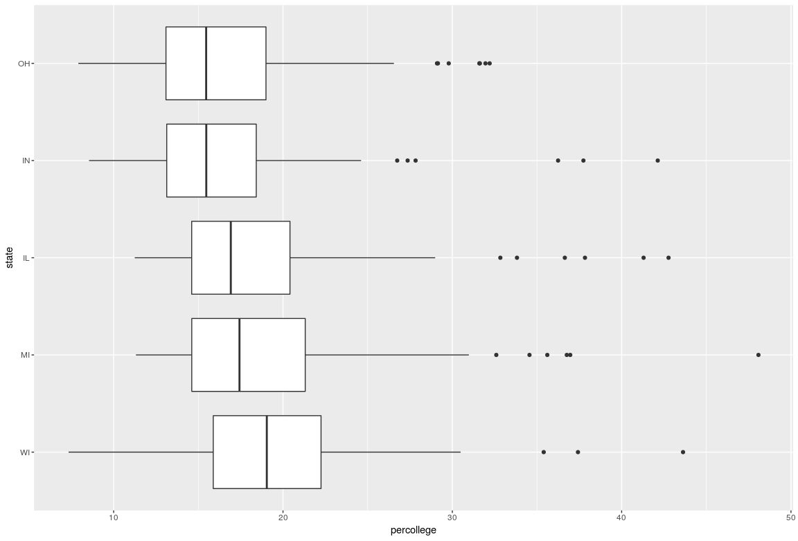
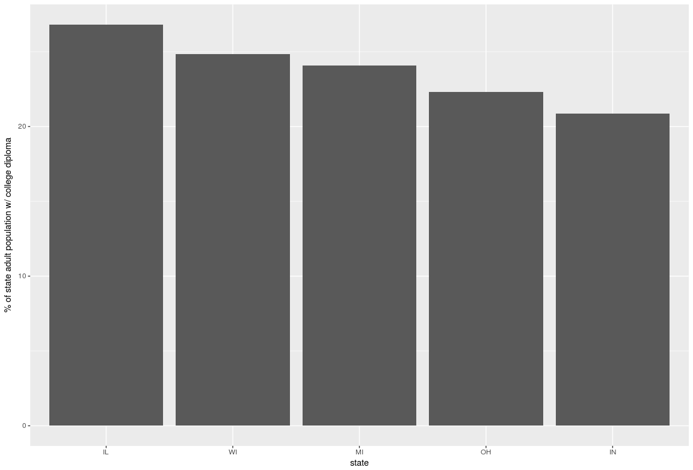
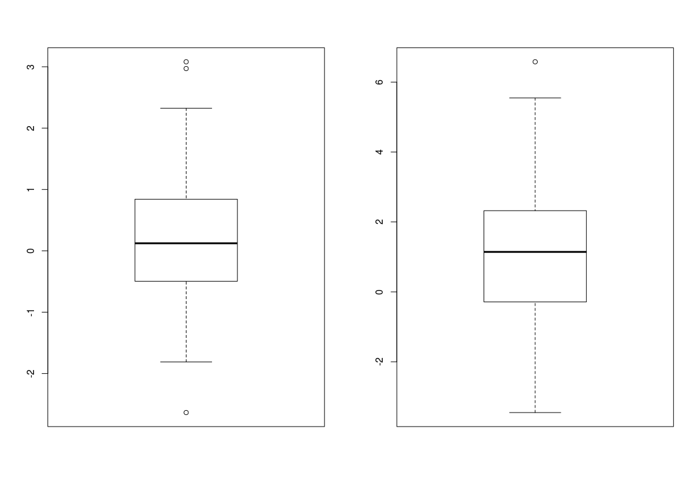

% HW2: Data Visualization - CSE 6242
% mmendiola3


# 1. Professional Employment by State

Assumptions:
  - The question is asking for a comparison of the percentage of each state's adult population with professional employment.
  - The number of adults with professional employment in each county is calculated as (midwest$percprof / 100) * midwest$popadults
  - The number of adults with professional employment in each state is the sum of adults with professional employment in each county within that state.
  - The percentage of adults with professional employment in each state is calculated as 100 * agg_by_state$proftotal / agg_by_state$popadults

Figure \ref{percprof} shows the percentage of each state's adult population with professional employment. This shows that IL has the highest percentage at 7.5%, while WI has the lowest at 5.6%.


# 2. School and College Education by State


## Relationship between HS diploma % and College diploma %

Assumptions:
  - The question is asking to explore the relationship between the UNALTERD values in midwest$perchsd and midwest$percollege NOT SEPERATED BY STATE.



Figure \ref{college_hsd} shows the relationship between the percentage of each county's adult population with a high school diploma and the percentage of those with a college diploma. Visually, we can observe a positive correlation in total and as well as for counties within each state. The correlation coefficient is 0.78 across the full dataset, which indicates a strong, possitive, relationship between the two.

## Relationship between HS diploma and state

Assumptions:
  - The question is asking to explore the relationship of the distribution of UNALTERD values in midwest$perchsd between the set of states.




The distribution of high school diploma percentages within each state is shown in Figure \ref{hsd_box}. We see that IL has the lowest median, WI has the highest. IL seems to have a wider range of values acrross it's counties. OH has the least variance among it's counties, but does have at least one county with a significantly lower value than the median (<25%). IL, OH, and WI are skewed to the left, indicating a number of lower valued counties pulling down the mean. IN and MI show the opposite skew.

Alternative Assumptions:
  - The question is asking for a comparison of the percentage of each state's adult population with a high school diploma.
  - The number of adults with a high school diploma in each county is calculated as (midwest$perchsd / 100) * midwest$popadults
  - The number of adults with a high school diploma in each state is the sum of adults with a high school diploma in each county within that state.
  - The percentage of adults with a high school diploma in each state is calculated as 100 * agg_by_state$hsdtotal / agg_by_state$popadults
  


Figure \ref{hsd_bar} shows the data aggregated at the state level. This view shows us much less information and makes each state's high school diploma percentages almost equal (all between 75% and 79%). Here WI has the highest overall value (78.6%) and IN the lowest (75.6%)

## Relationship between College diploma and state

Assumptions:
  - The question is asking to explore the relationship of the distribution of UNALTERD values in midwest$percollege between the set of states.



The distribution of college diploma percentages within each state is shown in Figure \ref{college_box}. OH has the lowest median (~16%) and WI has the highest (~19%). Each state has many outlier counties with significantly higher values (between 30% and 50%). Each state, with the exception of WI, seem to be skewed to the right; indicating they contain a number of counties with exceptionally higher college diploma percentages.

Alternative Assumptions:
  - The question is asking for a comparison of the percentage of each state's adult population with a college diploma.
  - The number of adults with a college diploma in each county is calculated as (midwest$percollege / 100) * midwest$popadults
  - The number of adults with a college diploma in each state is the sum of adults with a college diploma in each county within that state.
  - The percentage of adults with a college diploma in each state is calculated as 100 * agg_by_state$collegetotal / agg_by_state$popadults
  



Figure \ref{college_bar} shows the data aggregated at the state level. IL has the highest overall value (27%) and IN the lowest (21%). Comparing the aggregated values to the distributions shows that the outlier values pull the aggregated college percentages up significantly.


# 3. Comparison of Visualization Techniques

## Box Plot elements and relationship to size of a dataset

Assumptions:
  - The question is asking to identify the elements of a box plot

Box plots have the following elements:

- The IQR box shows the interval between the first and third quartiles. This shows where 50% of the data lays.
- The median line shows the point where half the data points are above and the other half are below.
- The whiskers show the range of values within the dataset. These lines are limited to 1.5x the length of the IQR.
- Outliers are points that fall outside the range of the whiskers.

Assumptions:
  - The question is asking to identify how each element of a box plot can be influenced by the properties of a dataset.



We can observe from Figure \ref{box_norm} how properties of a dataset affects each of these elements. The values for these two plots are:

```R
  # lefthand plot
  c(0,1,2,3,4,5,6,7,8,9, 20)
  # righthand plot
  c(0,1,1,1,4,4,6,7,8,9, 21)
```

We see that the lefthand plot has a median line at 5, while the righthand is at 4. These are the respective median values from the datasets. The IQR for each differs in size as the lefthand plot has less variance. Also, the righthand plot is skewed up, as it has a number of lower values (0,1,1,1,1) who's mean in pulled up by a small number of high values. In contrast, the lefthand plot is more symetric. The lefthand plot wiskers are differing lengths due to the outlier value that influences the median, but is not included in the value range. This is due it it being beyond 1.5x the IQR length. The same is true of the outlier in the righthand plot. However the wiskers are identical between plots, as the range of values are the same when excluding the outliers.

# Pros and cons of a Box Plot and a Histogram

Histograms are good for visualizing the distribution of values in a dataset. This is especially helpful if the distribution is multi-modal. However, they do not make it easy to get summary information about the distribution. Box plots allow one to see distribution parameters (median, range, percentiles, and outliers). This is helpful when comparing the distribution properties between multiple datasets. Finally, box plots are better at showing the distributions skew and symmetry, but are not as good at showing the shape of the distribution (to estimate the underlying theoretical distribution).

# Data for which to use Histograms, Box Plots, and QQPlots

Histograms are useful for visualizing the data's distribution. This is helpful when trying to gauge the type of underlying distribution the values could match. For example, we could see clearly whether data resembles a bimodal, uniform, or normal distribution, which we could not do with a box plot. As a qq-plot requires that you define the distribution to compare your data against, it is not a good choice when initially trying to identify a distribution.

Box plots are most useful when comparing data distribution statistics between multiple datasets or factors. The data from questions one and two are good examples, as we wanted to observe the differences between the range of values between the various states.

QQ-plots are most appropriate for comparing how the distribution of values compares to another distribution. This may include theoretical, statistical, distributions. For example, they would help to determine if the values in a dataset are normally distributed.


# 4. Random Scatterplots

## Samples
Assumptions:
  - The question is asking to generate and plot a few scatter plots of a number of uniformily distributed values against the same number of uniformiliy distributed values.
  - The question is asking to compare the filesize of these random scatter plots over a range of sample sizes when saved as ps, pdf, jpeg, and png files.
  


Figure \ref{rand_scatter} shows two plots of random x and y values. The top plot has 100 random points. The lower plot has 1,000 random points.

Figure \ref{filesize} shows the growth of the filesize for each filetype as the size of the sample being plotted increases. We see that jpeg and png files grow at first with the increase in sample size. This can be attributed to the raster formats' increase in pixels to encode as more samples are drawn. Eventually, the pixel density hits a point that more samples decrease the overall image complexity. From this point, additional samples decrease the filesize until a minimum size is reached to save a completely saturated plot image. Conversly, ps and pdf formats start out lower filesizes than the others, but quickly grow with the number of samples plotted. This is attributed to the increase in the number of objects that the vector image formats must encode. The growth for both of these formats is liniear O(n).

This plot indicates that for plots under a certain number of points (about 30k for in this case) vector formats are more space efficient. Beyond that, vector images are not only less efficient, but also have unbounded growth.


## 

# 5. Diamonds
