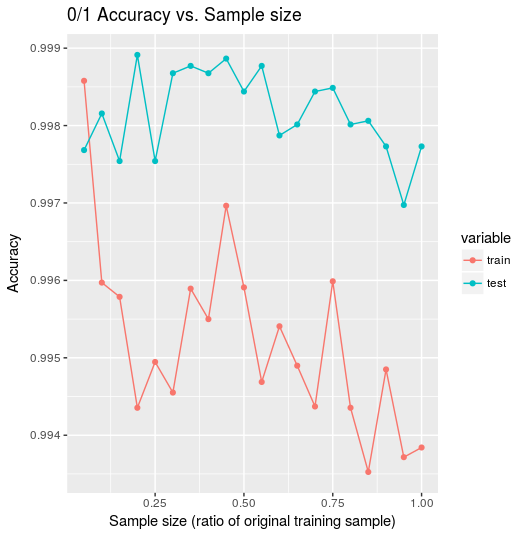
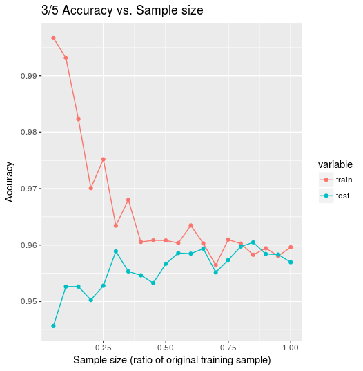
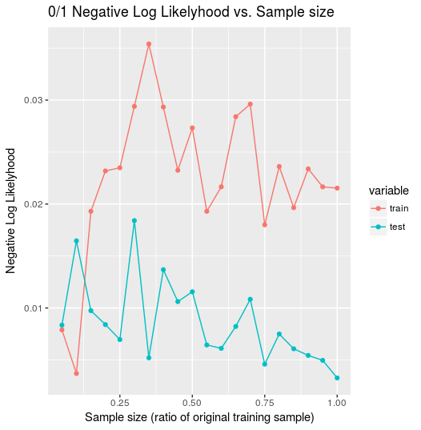
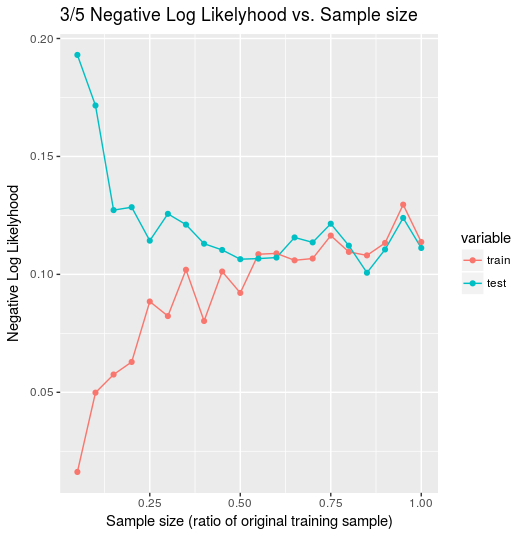

## 1. Theory

### a. Write down the formula for computing the gradient of the loss function used in Logistic Regression. Specify what each variable represents in the equation. 

Cost function:

$$
J(\theta) = \sum_{i=1}^nlog(1+\exp(y^i<\theta,x^i>)
$$
We'll add a constant $1/n$ to scale the update by the number of training samples.
Update function:

$$
\begin{aligned}
\theta_j & \leftarrow \theta_j - \alpha \frac{\partial}{\partial\theta_j}\sum_{i=1}^n log(1+\exp(y^i<\theta,x^i>))\\\\
& = \theta_j - \alpha \sum_{i=1}^n \frac{1}{1+\exp(y^i<\theta,x^i>)} \cdot \frac{\partial}{\partial \theta_j} \exp(y^i<\theta,x^i>)\\\\
& = \theta_j - \alpha \sum_{i=1}^n \frac{\exp(y^i<\theta,x^i>) \cdot \frac{\partial}{\partial \theta_j} y^i <\theta,x^i>}{1+\exp(y^i<\theta,x^i>)}\\\\
& = \theta_j - \alpha \sum_{i=1}^n \frac{\exp(y^i<\theta,x^i>) \cdot y^i x^i_j}{1+\exp(y^i<\theta,x^i>)}\\\\
&= \theta_j - \alpha \sum_{i=1}^n \frac{y^ix^i}{1+\exp(-y^i<\theta,x^i>)}
\end{aligned}
$$

note: $<\theta, x^i>$ is constant with the exception of $\theta_j \cdot x_j^i$

**Terms:**

- $\theta_j$ : The value of the current parameter vector at feature index j
- $\alpha$ : The learning rate, which decreases over each training iteration
- $n$ : The number of training samples
- $y^i$ : The classification label for training sample index $i$
- $x^i$ : The feature vector for training sample index $i$
- $<\theta, x^i>$ : The dot product of the parameter vector and the training sample at index $i$


### b. Write pseudocode for training a model using Logistic Regression. 

```{psudo}
Calculate negative log likelyhood for a given x, y, and theta
function calc_cost(x, y, theta):
  return 1/(log(1 + exp(y *<theta, x>)))

x = training matrix (n examples x d features)
y = training labels (n labels of -1 or 1)

set x^i_0 = 1 # for bias term
alpha = <some learning rate>
epsilon = <some stopping threshold value>
theta = generate random vector of size d+1 (feature count + bias)
cost = calc_cost(theta)
delta_cost = cost # tracks change in the cost function

while delta_cost > epsilon:
  theta = theta - alpha * sum((y*x) / (1 + exp(-y * <theta, x>)))
  new_cost = calc_cost(x, y, theta)
  delta_cost = cost - new_cost 
  cost = new_cost
  
theta is now trained against the sample set
 ``` 


### c. Calculate the number of operations per gradient descent iteration. (Hint: Use variable n for number of examples and d for dimensionality.) 


$$
\begin{aligned}
\sum_{i=1}^n f(i) & = O(n\cdot f(i))\\\\
y^i \cdot x^i & = O(d)\\\\
<\theta, x^i> & = O(d)\\\\
y^i \cdot h & = O(d)\\\\
\frac{f() \cdot g(d)}{1 + exp(h(d))} & = O(d)\\\\
\therefore\\\\
\sum_{i=1}^n \frac{y^ix^i}{1+\exp(-y^i<\theta,x^i>)} & = O(nd)
\end{aligned}
$$

There are a number of computations that are linear wrt d. The summation across samples adds the multiplicative factor n.

## 3. Training 
 
### a. Train 2 models, one on the train_0_1 set and another on train_3_5, and report the training and test accuracies. 

train_0_1 accuracy:  0.99242005527043
test_0_1 accuracy:  0.998108747044917

train_3_5 accuracy:  0.918022853185596
test_3_5 accuracy:  0.922187171398528

### b. Repeat 3a 10 times, i.e. you should obtain 10 train and test accuracies for each set. Calculate the average train and test accuracies over the 10 runs, and report them. 

Average train_0_1 accuracy:  0.993430714567706
Average test_0_1 accuracy:  0.997115839243499

Average train_3_5 accuracy:  0.942096606648199
Average test_3_5 accuracy:  0.946898002103049

### c. For 0,1 and 3,5 cases, explain if you observe any difference you in accuracy. Also, explain why do you think this difference might be.

There is a diference of ~0.05 between the average accuracy on 0/1 classification vs 3/5 classification. This is likely explained by the similarity between the characters being recognized in the 3/5 case compared to 0/1. The 3/5 samples do not have as clear of a decision boundary and therefore training and testing samples are being misclassified more often.


### d. This assignment deals with binary classification. Explain what you would do if you had more than two classes to classify, using logistic regression. 

I would split the task into multiple binary classification sub-tasks. For example, in the case of labels: (A, B, C), I would train logistic regression models for (A, non-A), (B, non-B), (C, non-C).

Predicting with each of these models, I would choose the prediction with the highest probability and apply that label.


## 4. Evaluation 
 
### a. Experiment with different initializations of the parameter used for gradient descent. Clearly mention the initial values of the parameter tried, run the same experiment as 3b using this initialization, report the average test and train accuracies obtained by using this initialization, mention which is set of initializations is the better. 

The baseline initial theta is set with random values between 0 and 1. The alternate theta is set with a uniform set of very small values (1e-9).

Average baseline train_3_5 accuracy:  0.942096606648199
Average baseline test_3_5 accuracy:  0.946898002103049

Average alternate theta train_3_5 accuracy: 0.959764542936288
Average alternate theta test_3_5 accuracy: 0.960199789695058

The alternate initial theta (small uniform values) had a higher average accuracy. This could be explained by the fact that most features (pixels) contribute nothing to the classification task. Random initial theta values for those features would need to be trained away. Near zero initial theta values seem to work better for data with many non-contributing features.


### b. Experiment with different convergence criteria for gradient descent. Clearly mention the new criteria tried, run the same experiment as 3b using this new criteria, report average test and train accuracies obtained using this criteria, mention which set of criteria is better. 

The baseline stopping criteria is when the cost function (average negative log likelyhood) falls below a set threshold (1e-3 in this case).

The alternative stopping criteria is when the l1-norm of the lastest change in theta falls below a set threshold. Threshold values of 1e-3 to 1e-12 were tested.

Average baseline train_3_5 accuracy:  0.942096606648199
Average baseline test_3_5 accuracy:  0.946898002103049

Average alternate stop train_3_5 accuracy: 0.530730609418283
Average alternate stop test_3_5 accuracy: 0.531019978969506

The alternative stopping criteria resulted in much lower average accuracy, even with very low threshold values. This could be explained by the use of stocastic vs batch gradient decent. It could be that the change in theta does not decrease as steadily as the negative log likelyhood, and this causes training to terminate permaturely.


## 5. Learning Curves 
 
### a. For each set of classes (0,1 and 3,5), choose the following sizes to train on: 5%, 10%, 15% ... 100% (i.e. 20 training set sizes). For each training set size, sample that many inputs from the respective complete training set (i.e. train_0_1 or train_3_5). Train your model on each subset selected, test it on the corresponding test set (i.e. test_0_1 or test_3_5), and graph the training and test set accuracy over each split (you should end up with TWO graphs - one showing training & test accuracy for 0,1 and another for 3,5 set). Remember to average the accuracy over 10 different divisions of the data each of the above sizes so the graphs will be less noisy. Comment on the trends of accuracy values you observe for each set. 

{#id .class width=60%}

A random sample of sizes 0.05 to 1.0 times the original sample was taken at 0.05 increments. 10 training runs were performed for each sample, and the average accuracy is shown in figure \ref{01-accuracy} and \ref{35-accuracy}. In the 1/0 example, accuracy remains fairly consistant other than an initial drop in training accuracy. Test accuracy also remains higher than training accuracy after a sample size of 0.05.

The stability indicates that very few training samples were needed to train a accurate model. The seperation between test and train accuracies could indicate that the training data is more noisy, while the test set includes more clearly distinguishable characters.


{#id .class width=60%}

The 3/5 accuracy plot shows that training and test accuracies start apart, with with training having near perfect accuracy. As sample size increases, training decreases and test increases.

The dropping training accuracy shows the model having a harder time fitting all the available data as the sample size increases. Test accuracy increases as the model is able to generate a theta that is more generalized. In this case, testing and training accuracies converged, which indicates similar quality examples in each set.


### b. Repeat 5a, but instead of plotting accuracies, plot the logistic loss/negative log likelihood when training and testing, for each size. Comment on the trends of loss values you observe for each set. 

{#id .class width=60%}

Figure \ref{01-neg-log-likelyhood} and \ref{35-neg-log-likelyhood} shows the train and test costs (negative log likelyhood) over various training set sizes. We see in the 0/1 plot a similar result (inverted) as the accuracy plot. Test cost remains relatively stable. Training cost starts lower than test cost and increases after about 0.3 times the full training set. Training cost remains seperate and higher than test from then on.

As with the accuracy plot, this behavior could be explained by a regression model that requires only a small training sample to build an high likelyhood predictor. The seperation matches the accuracy plot is possibly the result of cleaner test sample images than is used in the training set.


{#id .class width=60%}

Finally, the negative log likelyhood plot for the 3/5 regression task shows a similar behavior (inverted) to the accuracy plot. Cost drops on the test set while cost raises for the training set, as a result of the model's increasing generalization with more training data. The convergents between test and training cost shows the sample quality is similar between the two sets.


